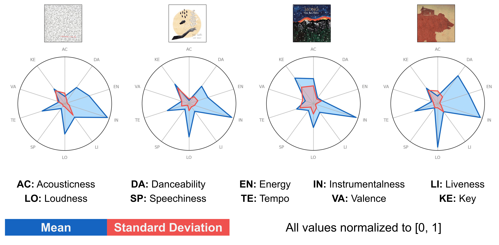

# AnalyzingPostRock

I use [the SpotiPy library](https://github.com/plamere/spotipy) to fetch audio features for music albums using [Spotify's Web API](https://developer.spotify.com/documentation/web-api/) and visualize them using radar plots. Since the mean (average) in itself would be a misleading indicator, I also visualize the standard deviations of these features.

In this repository, `Notebook.ipynb` contains the code for fetching the data and generating radar plots for [16 post-rock albums](https://www.reddit.com/r/postrock/comments/kjb8j4/oc_created_an_audio_features_visualization_of/ggy70ld/). The audio feature data is in `track_info.csv`, the individual album arts are in `albumart/` and the corresponding radar plots are in `radarplots/`. The album art and the radar plots are named using the first word of the album, since there was no naming conflict. This can easily be extended to a better `artist_album` naming convention.

The code should be self-explanatory and easy to extend to both artist-level visualization and more granular track level visualization (which would of course be without the standard deviation). I plan to clean up the code and add comments soon.

### [[Reddit post]](https://www.reddit.com/r/postrock/comments/kjb8j4/oc_created_an_audio_features_visualization_of/)

